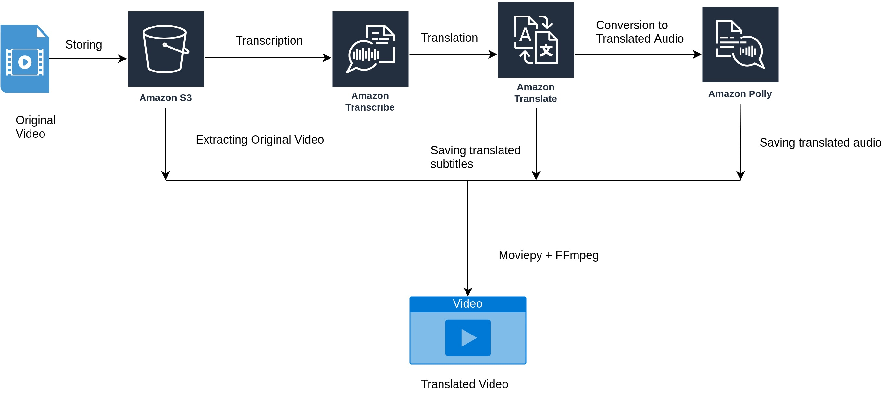

# Video-Translator

Translate audio and video for better understanding and far accessibility of the content.

## Flow Diagram


## Services Used
* S3
* FFmpeg
* Amazon Polly
* Amazon Transcribe
* AWS Cli
* Lambda
* Amazon Translate
* Moviepy

## How to run

* Create a S3 bucket.
* Upload the Video to that S3 bucket. (Also keep a copy of that video in the directory).
* Install aws cli and configure it with your access keys and secret and region. Tested for region us-east-1.
* Run the following command in the terminal

```
python translatevideo.py -r us-east-1 \
       -ib <input bucket name> \
       -if <video name> \
       -ol <output languages> \
       -av true \
       -ofn edited \
       -ob <output bucket name (can be same as input bucket name)> \
       -oft mp4
```


There might be errors sometimes because the some features that are used here (in Moviepy) are experimental and have not been completely tested by Moviepy.
